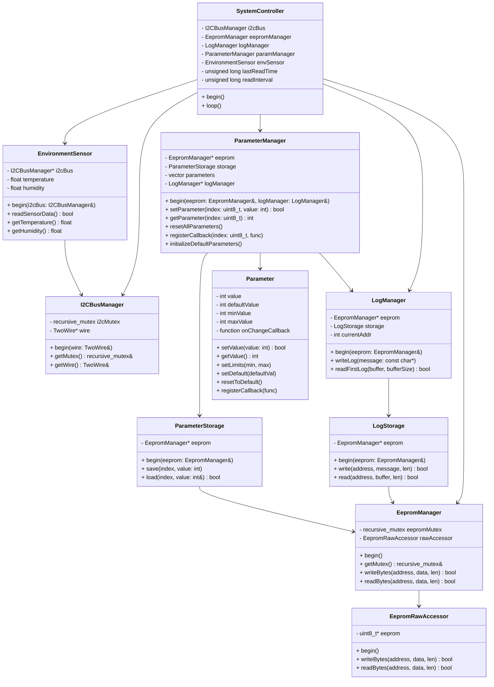

```mermaid
classDiagram
    class I2CBusManager {
        - recursive_mutex i2cMutex
        - TwoWire* wire
        + begin(wire: TwoWire&)
        + getMutex() recursive_mutex&
        + getWire() TwoWire&
    }

    class EepromRawAccessor {
        - uint8_t* eeprom
        + begin()
        + writeBytes(address, data, len) bool
        + readBytes(address, data, len) bool
    }

    class EepromManager {
        - recursive_mutex eepromMutex
        - EepromRawAccessor rawAccessor
        + begin()
        + getMutex() recursive_mutex&
        + writeBytes(address, data, len) bool
        + readBytes(address, data, len) bool
    }

    class LogStorage {
        - EepromManager* eeprom
        + begin(eeprom: EepromManager&)
        + write(address, message, len) bool
        + read(address, buffer, len) bool
    }

    class LogManager {
        - EepromManager* eeprom
        - LogStorage storage
        - int currentAddr
        + begin(eeprom: EepromManager&)
        + writeLog(message: const char*)
        + readFirstLog(buffer, bufferSize) bool
    }

    class Parameter {
        - int value
        - int defaultValue
        - int minValue
        - int maxValue
        - function onChangeCallback
        + setValue(value: int) bool
        + getValue() int
        + setLimits(min, max)
        + setDefault(defaultVal)
        + resetToDefault()
        + registerCallback(func)
    }

    class ParameterStorage {
        - EepromManager* eeprom
        + begin(eeprom: EepromManager&)
        + save(index, value: int)
        + load(index, value: int&) bool
    }

    class ParameterManager {
        - EepromManager* eeprom
        - ParameterStorage storage
        - vector<Parameter> parameters
        - LogManager* logManager
        + begin(eeprom: EepromManager&, logManager: LogManager&)
        + setParameter(index: uint8_t, value: int) bool
        + getParameter(index: uint8_t) int
        + resetAllParameters()
        + registerCallback(index: uint8_t, func)
        + initializeDefaultParameters()
    }

    class EnvironmentSensor {
        - I2CBusManager* i2cBus
        - float temperature
        - float humidity
        + begin(i2cBus: I2CBusManager&)
        + readSensorData() bool
        + getTemperature() float
        + getHumidity() float
    }

    class SystemController {
        - I2CBusManager i2cBus
        - EepromManager eepromManager
        - LogManager logManager
        - ParameterManager paramManager
        - EnvironmentSensor envSensor
        - unsigned long lastReadTime
        - unsigned long readInterval
        + begin()
        + loop()
    }

    %% 関係
    SystemController --> I2CBusManager
    SystemController --> EepromManager
    SystemController --> LogManager
    SystemController --> ParameterManager
    SystemController --> EnvironmentSensor
    ParameterManager --> Parameter
    ParameterManager --> ParameterStorage
    ParameterManager --> LogManager
    LogManager --> LogStorage
    LogStorage --> EepromManager
    ParameterStorage --> EepromManager
    EnvironmentSensor --> I2CBusManager
    EepromManager --> EepromRawAccessor

```